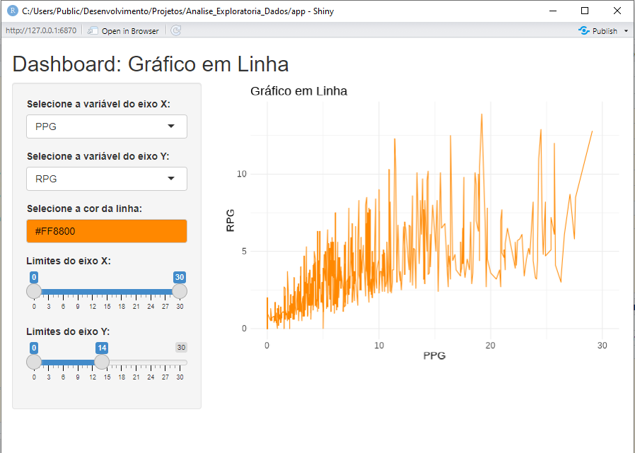

```{r setup, include=FALSE}
knitr::opts_chunk$set(echo = TRUE, fig.width = 6.4, fig.height = 4.8)
tinytex::install_tinytex(force = TRUE)
```

```{r importando bibliotecas 1, include = FALSE}
library(tidyverse)
library(tidyr)
library(purrr)
library(dlookr)
library(summarytools)
library(readxl)
library(knitr)
library(data.table)
library(ggpubr)
library(corrplot)
```

```{r importando bibliotecas 2, include = FALSE}
library(rcompanion)
library(stargazer)
library(mice)
library(rmarkdown)
library(tinytex)
library(sandwich)
library(magrittr)
library(shiny)
library(plm)
library(naniar)
```

# Introdução

Este projeto utiliza como base de dados informações sobre jogadores ativos da NBA, obtidas no [site oficial da NBA](https://www.nba.com/), na aba *Players*, no dia 22 de março de 2025. Os dados coletados incluem: nomes dos jogadores, equipes em que atuam, posições, altura, peso, data de nascimento, idade, média de pontos, rebotes e assistências por jogo da atual temporada, além de informações sobre o *Draft* e experiência profissional. Adicionalmente, foi criada uma variável indicando o mês de nascimento dos jogadores.
Com esses dados, é possível investigar diversas correlações estatísticas relevantes que ajudam a compreender o desempenho e as características dos atletas. Por exemplo, pode-se analisar a relação entre altura dos jogadores e a média de rebotes por jogo. Partindo da hipótese de que jogadores mais altos possuem vantagem nesse quesito, essa análise busca confirmar ou refutar tal tendência.
Outras correlações potencialmente interessantes incluem:  
- Peso e média de pontos por jogo: Investiga se jogadores com maior massa corporal têm vantagens em marcar pontos, especialmente em posições como pivô.  
- Assistências por jogo e pontos por jogo: Examina a relação entre jogadores que criam oportunidades para seus colegas de equipe e aqueles que executam as finalizações.  
- Altura e assistências por jogo: Avalia se jogadores mais baixos, como armadores, têm maior tendência a contribuir com assistências.
- Média de pontos por jogo e rebotes por jogo: Analisa a relação entre a capacidade de pontuar e pegar rebotes, considerando as diferentes posições em quadra.

Essas análises têm como objetivo explorar padrões e características que podem enriquecer a compreensão sobre o desempenho dos jogadores da NBA.


  

# Carregamento da base.

```{r Carregamento da base de jogadores da NBA, echo=TRUE, message=FALSE, warning=FALSE}
dados_tratados <- read_csv("Dados_auxiliares/dados_apos_coluna_mes.csv", quote = "\"",
                           locale = locale(encoding = "UTF-8"), show_col_types = FALSE)
```


```{r Tratamento dados númericos, echo=FALSE, message=FALSE, warning=FALSE}
dados <- dados_tratados %>%
  mutate(
    PPG = as.numeric(PPG),
    RPG = as.numeric(RPG),
    APG = as.numeric(APG),
  )
```

## Observações iniciais:
1 - Fazendo uma análise preliminar, verificamos que a linha 507 não possui dados em nenhuma das colunas, e foi determinada a eliminação dessa linha.

```{r Eliminação da linha 507, echo=TRUE}
dados <- dados %>% slice(-507)
```

2 - Após verificar as estatisticas individuais dos atletas que receberam NA nas colunas PPG, APG e RPG, verificamos que esses campos deveriam receber valor zero. O que foi realizado.

```{r Atribuir valor zero nos campos PPG, APG e RPG, echo=TRUE}
dados <- dados %>%
  mutate(
    PPG = replace_na(PPG, 0),
    RPG = replace_na(RPG, 0),
    APG = replace_na(APG, 0)
  )
```

3 - Foram encontrados dois registros com o campo Peso com valor NA. Os dados faltantes serão omitidos.

```{r Eliminação das linhas onde o Peso recebe NA, echo=TRUE}
dados <- dados %>% filter(!is.na(Peso))
```

Analisar a centralidade dos dados, dipersão, assimetria, bem como suas estatísticas de ordem, a fim de checar se há presença de outliers.

```{r Desc variavel Altura, Peso, Pontos, Rebotes e Assistências, echo=TRUE, message=FALSE, warning=FALSE, error=FALSE}
dados %>% dplyr::select(Altura, Peso, PPG, RPG, APG) %>% 
  summarytools::descr() %>% kable()
```


### Dispersão Altura x Rebotes

```{r Dispersão Altura e Rebotes, include=TRUE, echo=FALSE, message=FALSE, warning=FALSE, fig.width=6, fig.height=4, fig.align='center'}
dados %>% 
  ggplot(aes(x = Altura, y = RPG)) +
  geom_point() +
  geom_smooth(method = "lm", se = FALSE) +
  labs(title='Gráfico com a dispersão entre Altura e Rebotes por jogo', x='Altura', y='Rebotes por jogo') +
  theme_classic2()
```

Correlação entre as variaveis Altura e Rebotes por jogo

```{r Correlacao entre as variaveis Altura e Rebotes, echo = FALSE}
kable(cor(dados %>% dplyr::select(Altura, RPG)))
```

### Dispersão Peso x Pontos

```{r Dispersão Pontos e Peso, include=TRUE, echo=FALSE, message=FALSE, warning=FALSE, fig.width=6, fig.height=4, fig.align='center'}
dados %>% 
  ggplot(aes(x = Peso, y = PPG)) +
  geom_point() +
  geom_smooth(method = "lm", se = FALSE) +
  labs(title='Gráfico com a dispersão entre Peso e Pontos por jogo', x='Peso', y='Pontos por jogo') +
  theme_classic2()
```

Correlação entre as variaveis Peso e Pontos por jogo

```{r Correlacao entre as variaveis Peso e Pontos por jogo, echo = FALSE}
kable(cor(dados %>% dplyr::select(Peso, PPG)))
```


### Dispersão Pontos x Assistências

```{r Dispersão Pontos e Assistências, include=TRUE, echo=FALSE, message=FALSE, warning=FALSE, fig.width=6, fig.height=4, fig.align='center'}
dados %>% 
  ggplot(aes(x = PPG, y = APG)) +
  geom_point() +
  geom_smooth(method = "lm", se = FALSE) +
  labs(title='Gráfico com a dispersão entre Pontos por jogo e Assistências por jogo', x='Pontos por jogo', y='Assistências por jogo') +
  theme_classic2()
```

Correlação entre as variaveis Pontos e AssistÊncias por jogo

```{r Correlacao entre as variaveis Pontos e Assistências por jogo, echo = FALSE}
kable(cor(dados %>% dplyr::select(PPG, APG)))
```


### Dispersão Pontos x Rebotes

```{r Dispersão Pontos e Rebotes, include=TRUE, echo=FALSE ,message=FALSE, warning=FALSE, fig.width=6, fig.height=4, fig.align='center'}
dados %>% 
  ggplot(aes(x = PPG, y = RPG)) +
  geom_point() +
  geom_smooth(method = "lm", se = FALSE) +
  labs(title='Gráfico com a dispersão entre Pontos por jogo e Rebotes por jogo', x='Pontos por jogo', y='Rebotes por jogo') +
  theme_classic2()
```

Correlação entre as variaveis Pontos e Rebotes por jogo

```{r Correlacao entre as variaveis Pontos e Rebotes, echo = FALSE}
kable(cor(dados %>% dplyr::select(PPG, RPG)))
```


### Dispersão Altura x Assistências

```{r Dispersão Altura e Assistências, include=TRUE, echo=FALSE, message=FALSE, warning=FALSE, fig.width=6, fig.height=4, fig.align='center'}
dados %>% 
  ggplot(aes(x = Altura, y = APG)) +
  geom_point() +
  geom_smooth(method = "lm", se = FALSE) +
  labs(title='Gráfico com a dispersão entre Altura e Assistências por jogo', x='Altura', y='Assistências por jogo') +
  theme_classic2()
```

Correlação entre as variaveis Altura e Assistências por jogo

```{r Correlacao entre as variaveis Altura e Assistências por jogo, echo = FALSE}
kable(cor(dados %>% dplyr::select(Altura, APG)))
```


## Normalidade das variáveis

A normalidade das variáveis refere-se à ideia de que os dados seguem uma distribuição normal, também conhecida como distribuição gaussiana. Essa distribuição é simétrica em torno da média, com a maioria dos valores concentrados próximos a ela, e a frequência diminuindo à medida que os valores se afastam da média. É representada por uma curva em forma de sino.


### Definindo as funcoes geradoras de binwidths com as Regras de Freedman-Diaconis e Sturge

```{r definindo as funcoes geradoras de binwidths Freedman-Diaconis e Sturge , echo = TRUE}

fd <- function(x) {
  n <-length(x)
  return((2*IQR(x))/n^(1/3))
}

sr <- function(x) {
  n <-length(x)
  return((3.49*sd(x))/n^(1/3))
}
```


```{r Histograma de pontos por jogo com Regra de Freedman-Diaconis, echo=FALSE, fig.width=6, fig.height=4, fig.align='center'}
dados %>% dplyr::select(PPG) %>% ggplot(aes(x=PPG)) +
  geom_histogram(binwidth = fd) + 
  labs(title='Histograma de pontos por jogo',subtitle='Binarização pela Regra de Freedman-Diaconis' ,x='Pontos por jogo', y='Quantidade de jogadores')
```

```{r Histograma de pontos por jogo com Regra de Sturge, echo=FALSE, fig.width=6, fig.height=4, fig.align='center'}
dados %>% dplyr::select(PPG) %>% ggplot(aes(x=PPG)) +
  geom_histogram(binwidth = sr) + 
  labs(title='Histograma de pontos por jogo',subtitle='Binarização pela Regra de Sturge' ,x='Pontos por jogo', y='Quantidade de jogadores')
```

```{r Histograma de assistências por jogo com Regra de Freedman-Diaconis, echo=FALSE, fig.width=6, fig.height=4, fig.align='center'}
dados %>% dplyr::select(APG) %>% ggplot(aes(x=APG)) +
  geom_histogram(binwidth = fd) + 
  labs(title='Histograma de assistências por jogo',subtitle='Binarização pela Regra de Freedman-Diaconis' , x='Assistências por jogo', y='Quantidade de jogadores')
```

```{r Histograma de assistências por jogo com Regra de Sturge, echo=FALSE, fig.width=6, fig.height=4, fig.align='center'}
dados %>% dplyr::select(APG) %>% ggplot(aes(x=APG)) +
  geom_histogram(binwidth = sr) + 
  labs(title='Histograma de assistências por jogo',subtitle='Binarização pela Regra de Sturge' , x='Assistências por jogo', y='Quantidade de jogadores')
```

```{r Histograma de rebotes por jogo com Regra de Freedman-Diaconis, echo=FALSE, fig.width=6, fig.height=4, fig.align='center'}
dados %>% dplyr::select(RPG) %>% ggplot(aes(x=RPG)) +
  geom_histogram(binwidth = fd) + 
  labs(title='Histograma de rebotes por jogo', subtitle='Binarização pela Regra de Freedman-Diaconis' ,x='Pontos por jogo', y='Quantidade de jogadores')
```

```{r Histograma de rebotes por jogo com Regra de Sturge, echo=FALSE, fig.width=6, fig.height=4, fig.align='center'}
dados %>% dplyr::select(RPG) %>% ggplot(aes(x=RPG)) +
  geom_histogram(binwidth = sr) + 
  labs(title='Histograma de rebotes por jogo', subtitle='Binarização pela com Regra de Sturge', x='Pontos por jogo', y='Quantidade de jogadores')
```

```{r Histograma de Altura com Regra de Freedman-Diaconis, echo=FALSE, fig.width=6, fig.height=4, fig.align='center'}
dados %>% dplyr::select(Altura) %>% ggplot(aes(x=Altura)) +
  geom_histogram(binwidth = fd) + 
  labs(title='Histograma de Altura', subtitle='Binarização pela com Regra de Freedman-Diaconis', x='Altura', y='Quantidade de jogadores')
```

```{r Histograma de Altura com Regra de Regra de Sturge, echo=FALSE, fig.width=6, fig.height=4, fig.align='center'}
dados %>% dplyr::select(Altura) %>% ggplot(aes(x=Altura)) +
  geom_histogram(binwidth = sr) + 
  labs(title='Histograma de Altura', subtitle='Binarização pela com Regra de Sturge', x='Altura', y='Quantidade de jogadores')
```

```{r Histograma de Peso com Regra de Freedman-Diaconis, echo=FALSE, warning=FALSE, fig.width=6, fig.height=4, fig.align='center'}
dados %>% dplyr::select(Peso) %>% ggplot(aes(x=Peso)) +
  geom_histogram(binwidth = fd) + 
  labs(title='Histograma de Peso', subtitle='Binarização pela com Regra de Freedman-Diaconis', x='Peso', y='Quantidade de jogadores')
```

```{r Histograma de Peso com Regra de Sturge, echo=FALSE, warning=FALSE, fig.width=6, fig.height=4, fig.align='center'}
dados %>% dplyr::select(Peso) %>% ggplot(aes(x=Peso)) +
  geom_histogram(binwidth = sr) + 
  labs(title='Histograma de Peso', subtitle='Binarização pela com Regra de Sturge', x='Peso', y='Quantidade de jogadores')
```

### Q-Q Plot para checar visualmente a normalidade das distribuições

Q-Q Plot de Pontos por partida

```{r QQ Plot de Pontos por partida, echo=FALSE, fig.width=6, fig.height=4, fig.align='center'}
qqnorm(dados$PPG)
```

Q-Q Plot de Assistências por partida

```{r QQ Plot de Assistências por partida, echo=FALSE, fig.width=6, fig.height=4, fig.align='center'}
qqnorm(dados$APG)
```

Q-Q Plot de Rebotes por partida

```{r QQ Plot de Rebotes por partida, echo=FALSE, fig.width=6, fig.height=4, fig.align='center'}
qqnorm(dados$RPG)
```

Q-Q Plot de Peso

```{r QQ Plot de Peso, echo=FALSE, fig.width=6, fig.height=4, fig.align='center'}
qqnorm(dados$Peso)
```

Q-Q Plot de Altura

```{r QQ Plot de Altura, echo=FALSE, fig.width=6, fig.height=4, fig.align='center'}
qqnorm(dados$Altura)
```

### Teste de Shapiro-Wilk

A hipótese nula é: A distribuição de Pontos por partida segue distribuição normal.

A hipótese alternativa: A distribuição de Pontos por partida não segue distribuição normal.

```{r Testes de Shapiro Wilk, echo=FALSE}
shapiro.test(dados$PPG)
```

O resultado indica que devemos rejeitar a hipótese nula.Portanto, a distribuição de Pontos por partida não segue distribuição normal.

### Conclusão das normalidades:
Com base nos itens anteriores, é possível afirmar que as variáveis Altura e Peso, visualmente, são as que mais se aproximam de uma distribuição normal. Nos histogramas de Altura e Peso, verificamos um formato de sino e nos Q-Q Plots de Altura e Peso, o resultado foram retas muito próximas do que esperamos para as distribuições normais.

## Qualidade dos dados

A Completude dos Dados se refere à presença ou ausência de dados essenciais em um conjunto de dados. Um conjunto de dados é considerado completo quando todos os campos relevantes possuem valores registrados para a abálise, sem dados faltantes. A falta de completude afeta significativamente a confiabilidade de uma análise exploratória de dados, pelos motivos listados abaixo:
Os Dados ausentes podem introduzir viés, levando a conclusões incorretas.
Muitos funções e métodos assumem que os dados estão completos. Dados ausentes podem inviabilizar análises, como correlações ou regressões.
Variáveis com valores faltantes podem ser excluídas no pré-processamento, reduzindo a quantidade de dados disponível para análise.
A necessidade de lidar com valores ausentes, por meio de imputação ou outras técnicas, aumenta o esforço e o tempo necessários para realizar a análise.
Ou seja, a completude dos dados é fundamental para garantir a consistência e a precisão de insights extraídos de uma análise.

A análise foi feita utilizando as estatísticas dos jogadores ativos da NBA, no projeto em questão, em relação aos dados que foram utilizados nas análises, verificamos, através das estatística por partida, que os dados faltantes relacionados com as variáveis Pontos, Assistências e Rebotes por partida deveriam ser preenchidos com o valor 0 (zero), o que foi feito. Na coluna referente ao Peso dos atletas, apenas dois registros possuiam dados faltantes.
Embora a quantidade de dados faltantes tenha sido pequena, a quantidade de registros utilizados após o tratamento (466 registros) também é pequena. O ideal para a análise em questão teria sido a utilização de dados dos jogadores ativos e inativos, de forma a tornar a base de dados mais completa.

## Realize uma operação de imputação de dados usando o pacote MICE.

Criando uma nova Tibble com novo carregamento dos dados

```{r Carregamento da base de jogadores da NBA para imputação de dados, echo=TRUE, message=FALSE, warning=FALSE}
dados_brutos <- read_csv("Dados_auxiliares/dados_apos_coluna_mes.csv", quote = "\"",
                           locale = locale(encoding = "UTF-8"), show_col_types = FALSE)
```

Tratamento dos dados das colunas PPG, APG e RPG.

```{r Tratamento dados númericos para imputação de dados, echo=FALSE, message=FALSE, warning=FALSE}
dados_para_imputacao <- dados_brutos %>%
  mutate(
    PPG = as.numeric(PPG),
    RPG = as.numeric(RPG),
    APG = as.numeric(APG),
  )
```

Eliminação da linha 507.

```{r Eliminação da linha 507 para imputação de dados, echo=TRUE}
dados_para_imputacao <- dados_para_imputacao %>% slice(-507)
```

imputação de dados nas colunas PPG, APG e RPG.

```{r Atribuir valor zero nos campos PPG, APG e RPG para imputação de dados, echo=TRUE}
dados_para_imputacao <- dados_para_imputacao %>%
  mutate(
    PPG = replace_na(PPG, 0),
    RPG = replace_na(RPG, 0),
    APG = replace_na(APG, 0)
  )
```

Seleção de colunas.

```{r Select em imputação de dados, echo=TRUE}
dados_para_imputacao <- dados_para_imputacao %>% select(Altura, Peso)
```

Transformação em dataframe.

```{r as data frame, echo=TRUE}
dados_para_imputacao <- as.data.frame(lapply(dados_para_imputacao, function(x) {
  if (is.character(x)) {
    Encoding(x) <- "UTF-8"
  }
  return(x)
}))
```

Processo de imputação.

```{r processo de imputação, echo=TRUE}
imputed_data <- mice(dados, 
                     method = "pmm", 
                     m = 5)          
```

Tibble completo após a imputação.

```{r tibble completo após imputação, echo=TRUE}
dados_imputados <- complete(imputed_data)  
```

Densidade da Tibble original.

```{r densidade original, echo=TRUE, fig.width=6, fig.height=4, fig.align='center'}
dados %>% dplyr::select(Peso) %>% ggplot(aes(x=Peso, y = after_stat(density))) + 
  geom_density(linetype = 2) + 
  xlab('Peso') + 
  ylab('Densidade de Frequência') + 
  theme_classic()
```

Densidade da Tibble com os dados imputados.

```{r densidade após inclusão, echo=TRUE, fig.width=6, fig.height=4, fig.align='center'}
dados_imputados %>% dplyr::select(Peso) %>% ggplot(aes(x=Peso, y = after_stat(density))) + 
  geom_density(linetype = 2) + 
  xlab('Peso') + 
  ylab('Densidade de Frequência') + 
  theme_classic()
```

## Shiny

Crie um dashboard Shiny onde seja possível selecionar (tire um print-screen da tela final do sistema):
uma variável da sua base de dados e um gráfico em linha seja mostrado na tela;
escolher a cor da linha do gráfico;
selecionar o limite inferior e superior do eixo X do gráfico;
selecionar o limite inferior e superior do eixo Y do gráfico.



Abaixo segue o link do repositório no Github, onde pode ser encontrado os arquivos RMarkdown e Shiny:
[Repositório no Github](https://github.com/marcosperazo/analise_exploratoria_dados)