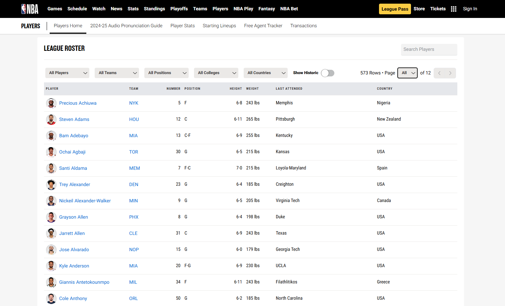

```{r setup, include=FALSE}
knitr::opts_chunk$set(echo = TRUE)
tinytex::install_tinytex(force = TRUE)
```

```{r importando bibliotecas 1, include = FALSE}
library(tidyverse)
library(tidyr)
library(purrr)
library(dlookr)
library(summarytools)
library(readxl)
library(knitr)
library(data.table)
library(ggpubr)
library(corrplot)
```

```{r importando bibliotecas 2, include = FALSE}
library(rcompanion)
library(stargazer)
library(mice)
library(rmarkdown)
library(tinytex)
library(sandwich)
library(magrittr)
library(shiny)
library(plm)
```

## Introdução

A base de dados escolhida para realizar esse projeto foi a de jogadores ativos da NBA. Essa base de dados foi a única base a utilizada durante toda a análise. E foi obtida no [Site da NBA](https://www.nba.com/), na aba Players, em 22 de março de 2025. Os dados capturados foram os nomes dos jogadores, time em que jogam, posição, altura, peso, data de nascimento, média de pontos, rebotes e assistências por jogo, além da idade, draft e exeriência. Foi criada uma coluna com o mês de nascimento dos jogadores.
Com os dados capturados, será possível explorar várias possíveis correlações importantes, como a altura dos jogadores e a média de rebotes por jogo. A tendência é de que jogadores mais altos têm vantagem nos rebotes. Essa correlação pode ser analisada para confirmar ou refutar essa tendência.
Seguem outras correlações possíveis:
O Peso dos jogadores e pontos por jogo: Pode ser interessante verificar se jogadores com maior massa corporal têm mais facilidade em marcar pontos, especialmente em posições como pivô.
As médias de assistências por jogo e de pontos por jogo, essa correlação pode mostrar a relação entre jogadores que criam oportunidades para os outros e aqueles que finalizam.
A altura dos jogadores e as assistências por jogo, jogadores mais baixos, como armadores, tendem a ter mais assistências. Essa relação pode ser interessante de analisar.
As médias de pontos por jogo e rebotes por jogo, pode haver uma relação entre jogadores que pontuam muito e sua capacidade de pegar rebotes, dependendo de suas posições em quadra.


Observe que é importante que haja dados faltantes em pelo menos uma variável para executar esse projeto. Explique qual o motivo para a escolha dessa base e aponte os resultados esperados através da análise.





## Carregamento da base.

```{r Carregamento da base de jogadores da NBA, echo=TRUE}
dados_tratados <- read_csv("Dados_auxiliares/dados_apos_coluna_mes.csv", quote = "\"",
                           locale = locale(encoding = "UTF-8"))
```

```{r Tratamento dados númericos, echo=TRUE}
dados <- dados_tratados %>%
  mutate(
    PPG = as.numeric(PPG),
    RPG = as.numeric(RPG),
    APG = as.numeric(APG),
  )
```

```{r frota, echo=TRUE}
kable(head(dados))
```

